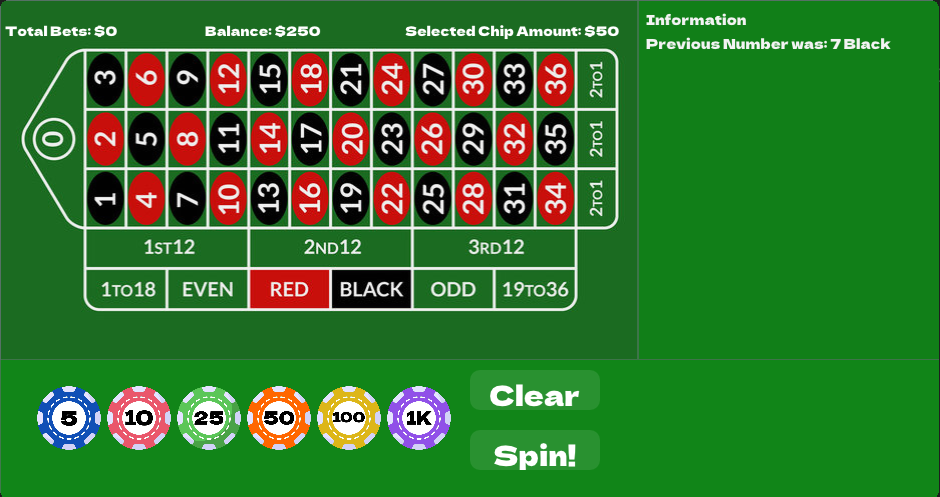

# <span style="color:#d42b43;">European Roulette in C++ with ImGui</span>

A simple European Roulette game implemented in C++ using the ImGui framework for rendering. The project includes a fully functional roulette game, a betting system, and a user interface built with ImGui, which allows users to interact with the game.

## <span style="color:#f3c00c;">Features</span>

### Betting System
Players can place different types of bets, such as:

- **Inside Bets**: Single Number Bet, Split Bet, Street Bet, Double Street Bet, Square Bet.
- **Outside Bets**: Red or Black, Odd or Even, Low or High (1-18 / 19-36).
- **Dozen Bets**: 1st 12, 2nd 12, 3rd 12.
- **Special Bets**: 2-to-1 Line Bet, Zero Bet.

### ImGui Interface
Custom-built interface with intuitive controls for an enhanced user experience.

### Game Logic
Randomized number selection for the roulette spin, adhering to European roulette rules.

### Statistics
Monitor total bets, current balance, selected chip value, and the history of previous spins.

## <span style="color:#f3c00c;">Screenshots</span> 

<div style="display:flex; flex-direction:column; gap:10px">
</img>
</img>
</div>

## <span style="color:#f3c00c;">Requirements</span> 

**Operating System**: Windows 10/11

**C++ Compiler**: Microsoft Visual Studio (MSVC) with support for C++17 or later

**Dependencies**:
- ImGui (already included in the project, no need for installation)
- DirectX 11 


## <span style="color:#f3c00c;">How to Play</span> 

1. **Pick Chip Amount**:  
   Choose a chip amount from the available options: $5, $10, $25, $50, $100, or $1000.

2. **Select Bet**:  
   Choose your desired bet type (e.g., Red, Black, Odd, Even, etc.).

3. **Spin**:  
   Press the "`Spin`" button to start the roulette round.

4. **Clear Bets**:  
   If you'd like to replace your bets, simply click on the "`CLEAR`" button to reset your selection.

## <span style="color:#f3c00c;">Build Instructions</span> 

To build this project, follow these steps:

1. **Clone the repository**  
First, clone the repository to your local machine using the following command:
    ```bash
    git clone <repository_url>
    ```
2. **Open the solution**  
Navigate to the project folder and open the solution file (`.sln`) in Visual Studio.

3. **Set the compiler version**  
In Visual Studio, set the C++ compiler version to Visual C++ 17 or higher

4. **Build the project**  
After setting the correct toolset, build the project by selecting **Build** > **Build Solution** in the top menu, or press **Ctrl + Shift + B**.

5. **Run the game**  
Once the build is complete, you can run the project by starting the application from Visual Studio or by executing the built executable file from the output directory.


## <span style="color:#f3c00c;">Acknowledgments</span> 

- **ImGui**: The project utilizes the ImGui framework for rendering the user interface.
- **DirectX 11**: Used for graphics rendering through ImGui’s DirectX11 binding.

## <span style="color:#f3c00c;">License</span> 

This project is licensed under the MIT License